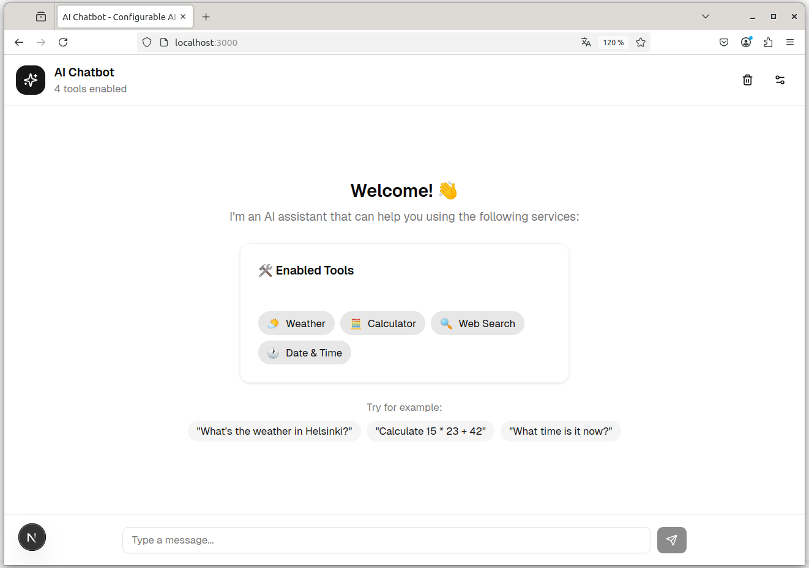
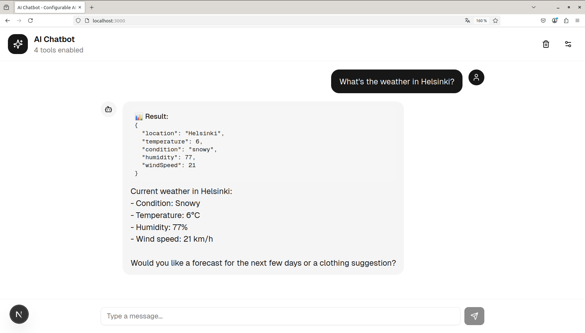

# AI Chatbot with Configurable Tools





A configurable AI chatbot application where you can enable and disable simulated tools using the Vercel AI SDK agent pattern.

Learn more: [How to Build AI Agents with Vercel and the AI SDK](https://vercel.com/kb/guide/how-to-build-ai-agents-with-vercel-and-the-ai-sdk)

## Setup

Create a `.env.local` file in the project root with the following environment variables:

```env
AI_GATEWAY_API_KEY=your-api-key-here
AI_GATEWAY_MODEL=openai/gpt-5-mini
```

## Getting Started

Install dependencies and run the development server:

```bash
npm i
npm run dev
```

Open [http://localhost:3000](http://localhost:3000) in your browser to see the application.
